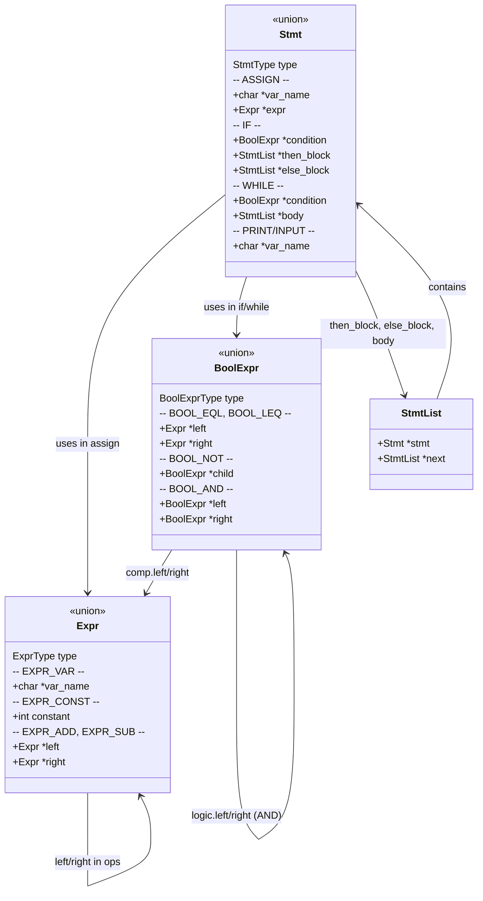

# Abstract Syntax Tree Mermaid diagram

```mermaid
classDiagram
    direction TB

    %% === Expr ===
    class Expr {
        <<union>>
        ExprType type
        -- EXPR_VAR --
        +char *var_name
        -- EXPR_CONST --
        +int constant
        -- EXPR_ADD, EXPR_SUB --
        +Expr *left
        +Expr *right
    }

    %% === BoolExpr ===
    class BoolExpr {
        <<union>>
        BoolExprType type
        -- BOOL_EQL, BOOL_LEQ --
        +Expr *left
        +Expr *right
        -- BOOL_NOT --
        +BoolExpr *child
        -- BOOL_AND --
        +BoolExpr *left
        +BoolExpr *right
    }

    %% === Stmt ===
    class Stmt {
        <<union>>
        StmtType type
        -- ASSIGN --
        +char *var_name
        +Expr *expr
        -- IF --
        +BoolExpr *condition
        +StmtList *then_block
        +StmtList *else_block
        -- WHILE --
        +BoolExpr *condition
        +StmtList *body
        -- PRINT/INPUT --
        +char *var_name
    }

    %% === StmtList ===
    class StmtList {
        +Stmt *stmt
        +StmtList *next
    }

    %% === Relationships ===
    StmtList --> Stmt : contains
    Stmt --> Expr : uses in assign
    Stmt --> BoolExpr : uses in if/while
    Stmt --> StmtList : then_block, else_block, body

    BoolExpr --> Expr : comp.left/right
    BoolExpr --> BoolExpr : child (NOT)
    BoolExpr --> BoolExpr : logic.left/right (AND)

    Expr --> Expr : left/right in ops
```
