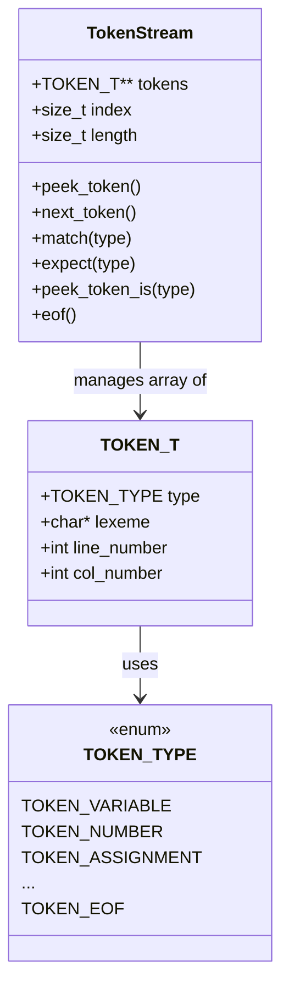

# Token UML

```mermaid
classDiagram
    direction TB

    class TOKEN_T {
        +TOKEN_TYPE type
        +char* lexeme
        +int line_number
        +int col_number
    }

    class TokenStream {
        +TOKEN_T** tokens
        +size_t index
        +size_t length
        +peek_token()
        +next_token()
        +match(type)
        +expect(type)
        +peek_token_is(type)
        +eof()
    }

    class TOKEN_TYPE {
        <<enum>>
        TOKEN_VARIABLE
        TOKEN_NUMBER
        TOKEN_ASSIGNMENT
        ...
        TOKEN_EOF
    }

    TokenStream --> TOKEN_T : manages array of
    TOKEN_T --> TOKEN_TYPE : uses
```
